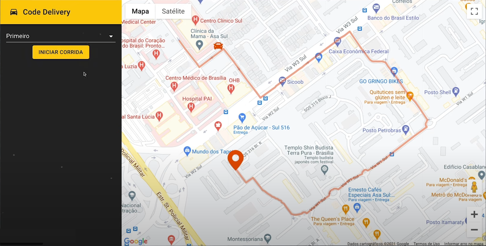
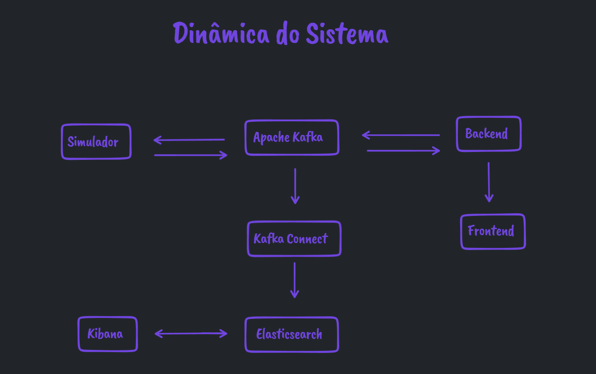

<h1 align="center">Code Delivery</h1>

  <a href="#-tecnologias">Tecnologias</a>&nbsp;&nbsp;&nbsp;|&nbsp;&nbsp;&nbsp;
  <a href="#-projeto">Projeto</a>&nbsp;&nbsp;&nbsp;|&nbsp;&nbsp;&nbsp;
  <a href="#memo-licença">Licença</a>

 
  
  

    

  

 

  

## 📄 Descrição:

### O que será desenvolvido?

- Sistema de entregas que permite visualizar em tempo real o veículo do entregador;
- Há possibilidade de múltiplos entregadores simultâneos;
- Serviço simulador que enviará a posição em tempo real de cada entregador;
- Os dados de cada entrega, bem como as posições, serão armazenadas no [Elasticsearch](https://www.elastic.co/pt/elasticsearch/) para futuras análises.

## 🆘 Principais Desafios:

### ❎ Para evitar perda de informação caso o serviço de backend fique indisponível por alguns momentos, não trabalharemos com REST.

### ✅ SOLUÇÃO: trabalharemos com o Apache Kafka para o envio e recebimento de dados entre os sistemas.

### ❎ Não é responsabilidade do serviço de backend persistir os dados no Elasticsearch. Logo, como armazenar as informações no Elasticsearch?

### ✅ SOLUÇÃO: Utilizaremos o Kafka Connect que também consumirá os dados do simulador e fará a inserção no Elasticsearch.

### ❎ Precisamos exibir em tempo real a localização de cada entregador.

### ✅ SOLUÇÃO: Trabalharemos com websockets (O backend receberá os dados do simulador, e enviará as posições para o frontend via websocket).

## 🚀 Tecnologias:

Esse projeto foi desenvolvido com as seguintes tecnologias:

### Simulador: [Golang](https://www.golang.org/) 🌀

### Backend: Nest.js & Mongo 🐯🍃

### Frontend: React & Material UI ⚛️

### [Kafka & Kafka Connect](https://kafka.apache.org/intro/) 🔅

### [Elasticsearch](https://www.elastic.co/pt/elasticsearch/) 🔷

### Doker & Kubernetes 🐋

### Istio, Kiali, Prometheus & Grafana.

## 🚧 Projeto:

### Em construção!

## 🎨 Inspiração:

### Projeto desenvolvido durante a Imersão Full Stack\_ && Full Cycle.

## 📝 Licença

Esse projeto está sob a licença MIT. Veja o arquivo LICENSE para mais detalhes.

Made by Jhonatan Oliveira.
